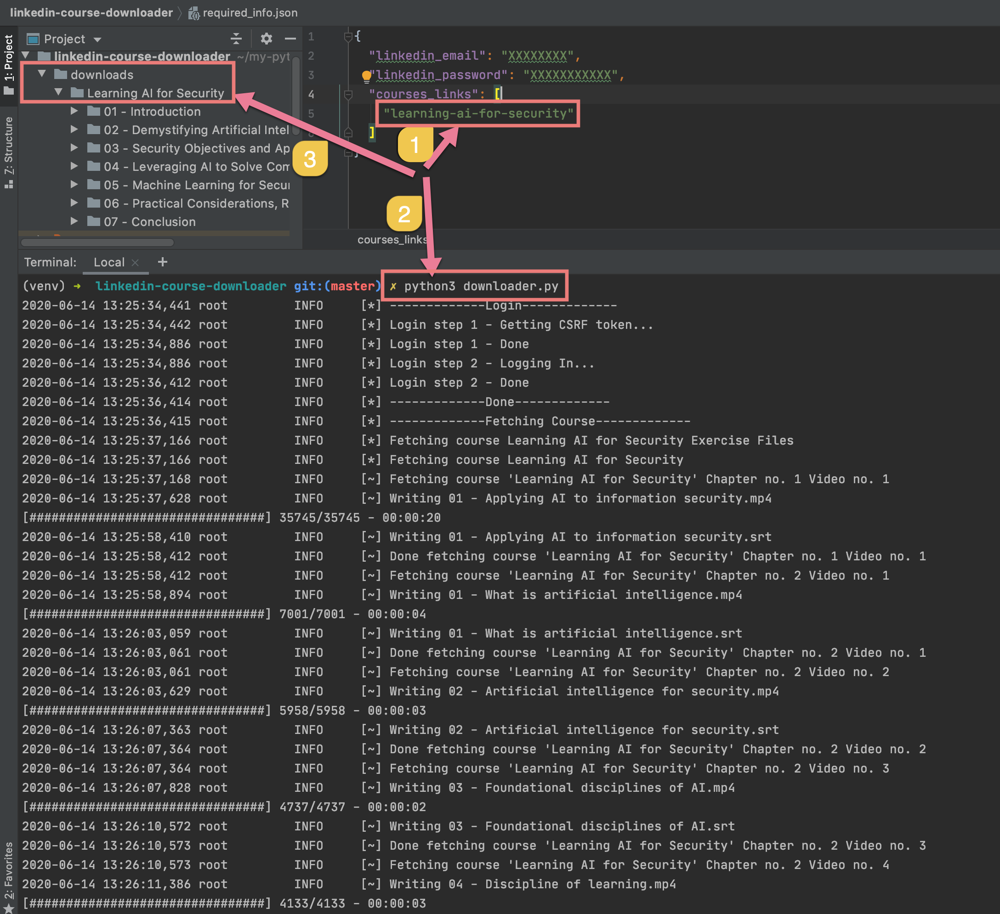

# linkedin-course-downloader
python script for downloading courses from linkedin learning with subtitles


### Based on Ahmed Soliman's linkedin-learning-downloader But got restructured and modified 

## Dependencies:

- Python 3
- requests
- lxml
- clint

Please use this script for your own purposes.

This script was written for educational usage and personal use only.

Make sure your LinkedIn account is NOT protected with 2FA

## Please copy the `required_info.json.sample` to `required_info.json`
## And then open `required_info.json` to put your  (linkedin email, password, and courses slugs or courses links)

it will be like this

```json
{
    "linkedin_email": "",
    "linkedin_password": "",
    "courses_links": [
            "https://www.linkedin.com/learning/learning-c-5", 
            "learning-c-5"
  ]
}
```

e.g:
COURSE URL: https://www.linkedin.com/learning/python-advanced-design-pattern
->
SLUG: python-advanced-design-pattern

## Installation
### Installing virtualenv
##### On macOS and Linux:

```shell script
$ python3 -m pip3 install --user virtualenv
```

##### On Windows:
```shell script
$ py -m pip install --user virtualenv
```

### Creating a virtual environment
##### On macOS and Linux:

```shell script
$ python3 -m venv env
```

##### On Windows:

```shell script
$ py -m venv env
```

### Activating a virtual environment
##### On macOS and Linux:
```shell script
$ source env/bin/activate
```

##### On Windows:

```shell script
$ .\env\Scripts\activate
```

You can confirm you’re in the virtual environment by checking the location of your Python interpreter, it should point to the env directory.

##### On macOS and Linux:

```shell script
$ which python
.../env/bin/python
```

##### On Windows:

```shell script
$ where python
.../env/bin/python.exe
```

## Installing dependencies:

```shell script
$ pip3 install -r requirements.txt
```

## Usage

```shell script
$ python3 downloader.py
```

## Proof of download


